# SlopeCraft Tutorial

!!! info "info"
	This document partly utilizes ChatGPT for translation.

This document will show you how to use SlopeCraft to create 3d, flat and file-only maps.

To eliminate ambiguity, the defination of serveral terms are listed.

|     Term      | Meaning                                                                   |
| :-----------: | :------------------------------------------------------------------------ |
|   Map item    | The item in Minecraft, which id is `minecraft:filled_map`                 |
|    Save(s)    | The game saves of Minecraft                                               |
|      Map      | The image displayed in map item                                           |
| Map data file | The nbt binary file that stores data of a "Map", named like `map_<i>.dat` |

!!! tip "tip"
	You can find the option to switch languages in the Languages drop-down menu in the menu bar.

## Step 0. Image preprocessing

First, prepare the original image that you want to make into a map. The image used here is the one [drawn by Lancet_Corgi](https://t.bilibili.com/544583492149793294), thanks to the permission of him.

Using ps or other software that can edit the image, **scale it to an integer multiple of 128 pixels**.

Here I scaled the image to 256 x 256 pixels, which is exactly the size of a 2 x 2 map.


(Resizing **is not mandatory** and SlopeCraft does not include the ability to scale images, but I highly recommend it)

Save this image well.

## Step 1. Map Configuration

Double-click to launch SlopeCraft.exe, and you will see the following interface.

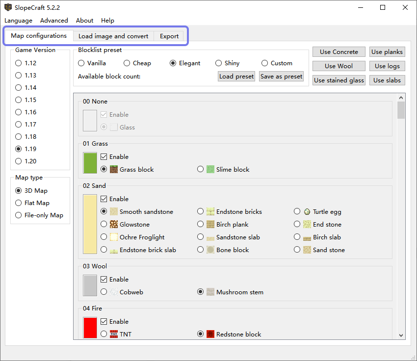

The three tabs at the top represent the three steps of creating a map drawing:

1. Map Configurations
2. Load image and convert
3. Export

Outside of this software, there is a fourth step: importing files into the game.

At this point, you should be on the Map Configuration interface. In this interface, you need to complete three small steps, which are explained below separately:

### 1.1 Select Game Version

You need to set the map to correspond to game version.

At the moment from 1.12 to 1.20 are supported, I will continue to follow the updated version, but will not support the boss book before 1.12.

Note that there is no difference between 1.12 and 1.15 in the "picture quality" of the maps, as the flat map has **51 colors** and the 3D map has **153 colors**. 1.16 adds 7 basic colors to the netherworld tree, so the flat map can use **58 colors** and the 3D map can use **174 colors**. 1.16 adds 7 basic colors to the netherworld tree, so the flat map can use **58 colors** and the 3D map can use **174 colors**. 1.17 added colors for deep slate, pig iron blocks and glowing lichen, so you can use **61 colors** for flat maps and **183 colors** for 3D map.

> *Tweets: Mojang Why give so many colors to the netherworld tree? Wouldn't it be good to have more flesh colors?*

### 1.2 Set the map of type

Here you need to choose **type of the map**:

- **3D Map**: It can achieve **rich colors** and **exquisite quality**, but it is more difficult to build.
- **Flat Map**: A traditional type of map drawing with **average quality**, easier to build.
- **File-only Map**: The **ultimate quality** achievable by original map drawings, cannot be built directly and usually obtained through commands. If you don't want the map to be in the game as blocks, but just want it to appear on the map and be able to be attached to the item display box, then select this option.

    Please note that this type of File-only Map requires at least file replacement in the game save and may also require commands. It is generally only suitable for single-player games. If you are a server administrator, you can also use it.

Here, I chose the 3D map.

### 1.3 Set Block List

The list of blocks is actually the "**Materials List**", or "**Palette**" of a map. **It determines which colors are in the palette of the map, and which blocks correspond to each color.**

This page is a bit more complicated, so I'll cover each section in turn. **(Actually, in general, the list of blocks doesn't need much convertion by itself)**

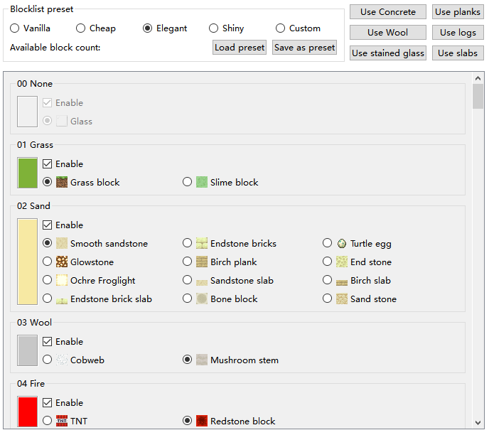

Each of the base colors is shown in the slider. In the **Enable** box, you can check **Whether to allow SlopeCraft to use this color**. By default, except for **water**, each available base color is selected (some colors are not available in lower versions).

Below the enable box is the box **which corresponds to each color**. Only one block can be used for each color in the palette.

- You may think that many of the blocks in the diagram are different colors, but please note that **they are identical in the "eye of the map "** and the only basis for selection is whether the blocks are easy to mass-produce.
- Some base colors are only available in one block, however the palette cannot be left blank, so this option is unchangeable, like the glass or *emerald block(not shown in the image)* in the picture, it must be selected.


There are list of four preset blocks at the top:

- Vanilla is the "**original**" one, trying to use the "original blocks" of each color. It is more suitable for creation mode, not for survival.
- Cheap is the **cheapest block**, making sure that every block is mass-produced. It is suitable for pre-survival.
- Elegant is to try to choose the "**most elegant block**" if it is possible to survive the actual installation, for example, try to choose the block that can't be stolen by Blackie, which is both beautiful and not too difficult to mass-produce. This is the default option.
- Shiny **is made for light and shadow**, it tries to choose glowing blocks, and tries to be gorgeous enough in light and shadow.
- Custom means you use a list of **custom** blocks.

**The block list presets will show you how many colors you can use for this map.** If you disable some of the base colors, then this number will be reduced a bit. **So the richer the color palette and the larger the size of the map, the better the picture quality.**

The buttons like **priority to use concrete** in the upper right corner are for batch operations, the meaning is obvious, no more explanation.

#### Blocklist preset

SlopeCraft allows to export the current block list settings to a file, or to load a preset file. The file is stored in json and has the suffix `.sc_preset_json`.

______________________________________________________________________________________________________________

After completing these settings, click on the "**Load image and convert**" menu at the top to proceed to the next step.

## Step 2. Load image and convert

On this interface, you need to complete two small steps: import the image and convert it into a map.

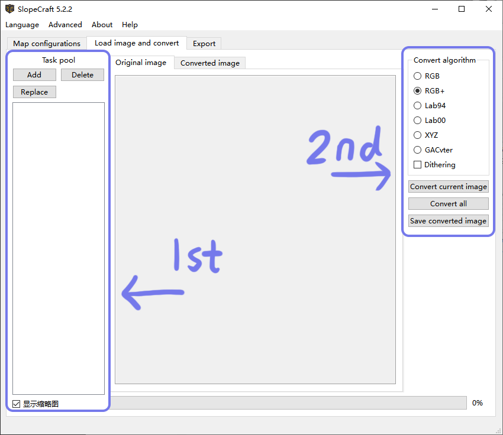

### 2.1 Import Images

??? question "What is the "Task Pool"?"  
    SlopeCraft introduced a new feature in version 5.10: the "**Task Pool**".  
    Each image you import will be created as a Task by the program, and various conversion operations will add data to the Task.  

    The operation logic of the Task pool is similar to the system file manager: select a single image, preview, or perform corresponding operations.

    In simple terms, you can now easily perform batch operations!  
    **Note: The same batch of images can only use one conversion algorithm. It is recommended to process images with significant style and color differences separately!**

In the Task pool, click **Add** to import **one or more** preprocessed images.

If your original image has transparent or semi-transparent pixels, the interface for setting the **transparent pixel processing strategy** will automatically appear. Details are as follows:

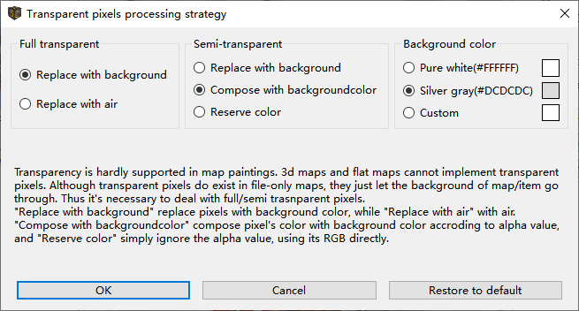

Transparent pixel handling strategies have different ways to handle pure transparent pixels (alpha=0) and semi-transparent pixels (alpha>0). A pure transparent pixel can either be replaced with the background color or set to air; a semi-transparent pixel can either be replaced with the background color or overlaid and blended with the background color, or its transparency property can be ignored and treated directly as an opaque pixel. Alternatively the background color can be set, the default background color is a light gray when the snow block is tiled, or you can choose pure white, or any custom color.

**Please note: Transparent pixels will be processed upon import. If you are not satisfied with the processing results, please delete the Task in the Task pool and re-import the image.**

After importing the images, the corresponding Tasks will be displayed in the Task pool on the left. Select the appropriate Task for preview.

### 2.2 Convert Image

After completing the above preliminaries, it's time to move on to the main meal: converting the image into a map.

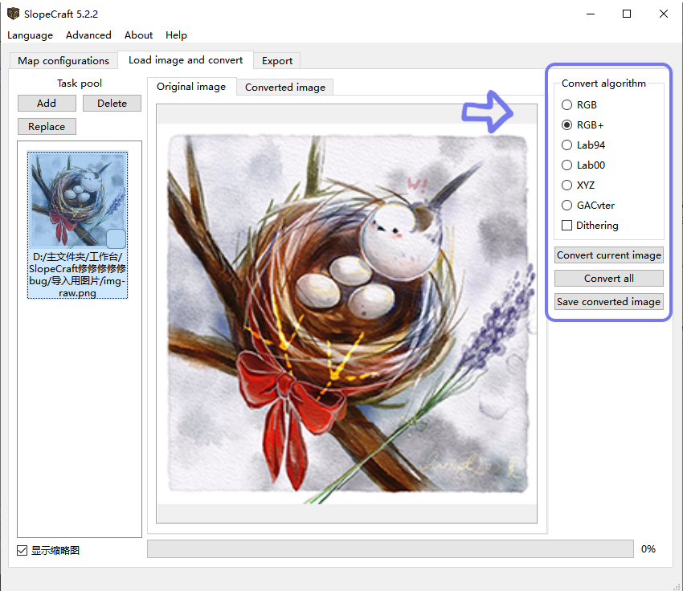

#### Select Conversion Algorithm

The **Convert Current Image** button adjusts the colors of the image to the colors available in the map's palette. The **Original** and **Converted** images displayed above the preview box show the original image and the adjusted map drawing, respectively, making it easy for you to compare.

The color space above has 6 options, **represents 6 ways to adjust the color.** **Dithering** then uses the Floyd-Steinberg algorithm, which tries to blend with several similar colors to try to fit the original image better.

Each of the first five conversion algorithms corresponds to five different color difference formulas. The algorithms RGB+ is the most recommended, RGB and XYZ are the fastest, Lab94 and Lab00 are better but slower. GACvter is the slowest, but if the first 5 algorithms are not satisfactory, you can try it.

The first 5 algorithms only consider the color of pixels, not their spatial positions; they are called traditional algorithms. The 6th algorithm, GACvter, uses the results generated by the first 5 algorithms as "seeds" to find a solution that is closer to the original image by searching for edge contours. This new algorithm considers both the color and position of pixels and is an intelligent algorithm.

Each of these 6 convertions has a different effect on the same image.

We all want the ground picture to be as close to the original as possible, so you can try each convertion in turn and compare them back and forth with two buttons to choose the one that works best.

|  |  |
| :-------------------------------------------------------------------------: | :-------------------------------------------------------------------------------: |
|                              Before convertion                              |                                 After convertion                                  |

The process of converting images may be slow, especially for larger images. **If the progress bar suddenly stalls or even the window is not responding, please don't close the window, don't do anything, just wait patiently.** The process of converting images has a lot of calculation tasks, and it is normal to get stuck.

#### Convert All Images (Batch Processing with Special Operations)

After you have selected your favorite algorithm, please click the **Convert All** button to convert all tasks in the task pool. When the conversion is complete, there should be a ✔ in the lower right corner of each task.

______________________________________________________________________________________________________________

After converting all images **(make sure there is a ✔ in the lower right corner of each task)**, you will proceed to the final step of generating the map drawing: **Export**.

## Step 3. Export

There are 6 types of exports, and the following table documents the relationship between the various map types and the export types.

|              Export Type              | 3D Map | Flat Map | File-only Map |
| :-----------------------------------: | :----: | :------: | :-----------: |
|  Litematica schematic (\*.litematic)  |   ✔    |    ✔     |               |
| Vanilla structure block file (\*.nbt) |   ✔    |    ✔     |               |
|       WE schematics (\*.schem)        |   ✔    |    ✔     |
|        Map data file (\*.dat)         |   ✔    |    ✔     |       ✔       | ✔ |
|   Converted images (\*.png \*.jpg)    |   ✔    |    ✔     |       ✔       | ✔ |
|     Flat diagram (\*.png \*.jpg)      |        |    ✔     |

**Note: WE schematics (\*.schem) are only supported in version 1.13+. In 1.12, WE uses the old schematic format with the \*.schematic suffix, which is not currently supported by SlopeCraft.**

Select the type of export you need on the export interface and make the corresponding settings.

Because the [first four export types](#3a-export-as-litematica-vanilla-structure-we-schem-flat-diagram "Jump to the corresponding section") involve three-dimensional structures and settings, they are significantly different from [map data file types](#3b-export-as-map-data-files "Jump to the corresponding section"), so they will be introduced separately below.  
(Click on the export type name to jump to the corresponding section)

### 3.a Export as Litematica / Vanilla structure / WE schem / Flat diagram

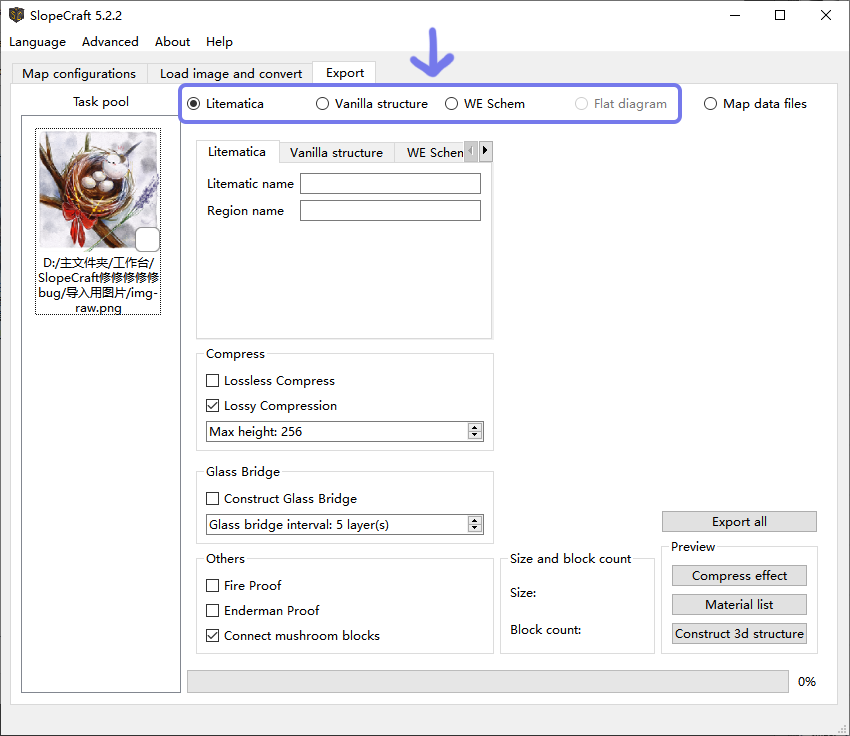

#### Compress (Not applicable to flat maps)

SlopeCraft supports two types of compression: lossy and lossless.

In simple terms, lossless compression is a way to compress the total height of the ground picture at the cost of continuity while **strictly ensuring that the color of each pixel remains the same**, but it is more constrained and may not work as desired. It is no exaggeration to say that some pictures are incompressible, such as the pure white part. This is when a new compression technique is needed: intelligent lossy compression.

Lossy compression then **slightly tunes the color of individual pixels** and compresses the total height of the ground picture so that it is less than or equal to the maximum allowed height specified by the user. The lossy compression is implemented using a genetic algorithm, which is part of the population artificial intelligence and is the most technically advanced module in SlopeCraft. The maximum allowable height should not be lower than 14, otherwise the 3D map is likely to fail.

In general, the smaller the maximum allowable height for lossy compression, the more significant the loss of image quality. As follows, this image is made into a 3D map with a height of 255 frames and is now compressed with lossy compression (with lossless compression enabled). Figure 1 shows the result of the build with a maximum height of 100 frames, and Figure 2 shows the result of the build with a maximum height of 20 frames.

|  |  |
| :------------------------------------------------------------------------------------------: | :----------------------------------------------------------------------------------------: |
|                                          Figure  1                                           |                                          Figure 2                                          |

There is no significant change before and after compression, and the damage to the image quality is not obvious. However, we can still find some gray dots in the left and right white parts, and Figure 2 has more gray dots than Figure 1 due to the high compression degree. In addition, the genetic algorithm is a random optimization algorithm, and the modified pixels have some randomness and do not show an obvious regular pattern.

Lossy and lossless compression can be used together or separately. However, in general, if lossy compression is enabled, it makes no sense not to enable lossless compression. Pure lossy compression requires more pixels to be modified, which will cause more damage to the image quality, while lossless compression can complete the compression task with fewer pixels to be modified, largely reducing the damage to the image quality.

You can turn on both options for flat maps, but it **will not play any role**.

#### Glass bridge

There are many scattered blocks in each horizontal section of the three-dimensional map, which is extremely inconvenient to build, and if multiple pathways can be used to connect these scattered blocks, it will certainly make the construction easier. Building bridges is the process of connecting all the blocks in a horizontal plane with glass blocks to form pathways to assist the player in building.

There is no doubt that bridging consumes additional glass, so it is not recommended to perform bridging on every level of the diorama. By default, bridges are built every 4 levels, but you can modify this interval. If the interval is too large, the effect of bridge building will be reduced; if the interval is too small, the glass will be wasted.

For more information on map compression and bridging, you can read [Principle Introduction](./principles-introduction.md)。

[AbrasiveBoar902](https://github.com/AbrasiveBoar902) has been of great help in optimizing the performance of the hitch, and his help is appreciated.

#### Other Options

- **Fire proof / Enderman proof:**  As the name implies, this is to protect the combustible blocks and avoid the little black steal something. The specific method is to wrap each of these blocks with glass exposed surface, pro-tested effective. But this will also consume a lot of glass at the same time, need to choose carefully.

- **Connect Mushroom Blocks:** The map drawings generated by SlopeCraft may contain multiple adjacent mushroom blocks (including red mushroom blocks, brown mushroom blocks, and mushroom stem blocks). The surfaces where they contact each other should be pore surfaces, but they are not in the generated projection. This feature will search for all adjacent mushroom blocks and correct the surfaces where they contact each other to pore surfaces.

#### Additional Export Options

The first four export methods each allow you to enter additional export options, attach additional meta information, and are described below in turn.

=== "Litematica"

	You can enter information about the projection file in the "Projection Name" and "Projection Area Name" fields, but this is not mandatory.

	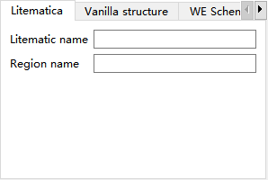

=== "Vanilla structure"

	The original structure block file is stored using a sparse matrix, where areas that are not stored represent air blocks. This storage method makes the structure block file the format with the best compatibility with the original version but the worst compression ratio.

	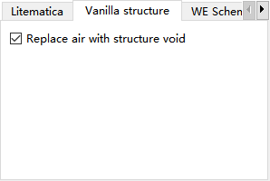

	Therefore, there are two options for storing air blocks in the structure block file: treat them as structure vacancies or store them as they are. Treating them as structure vacancies can greatly save space, but when pasting the structure block, it cannot overwrite other non-air blocks; storing them as air blocks can overcome this problem, but the file size will be large.

=== "WE schematic"

	WorldEdit schematic has a few attributes, which are reverse-engineered from the schematics generated by WorldEdit and directly correspond to the same-named nbt tags.

	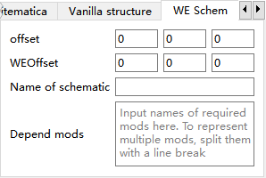

	I am not sure how these attributes affect the schematic, as I hardly use WorldEdit.

=== "Flat Diagram"

	Set whether the exported diagram contains dividing lines and the spacing of dividing lines.

	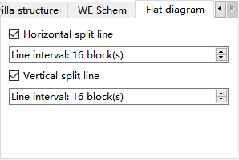

#### Pre-build 3D Structure for Preview (Optional)

Clicking **Construct 3d structure** will use the current settings to pre-build the map into a 3D structure, and display the dimensions and total number of blocks of the projection.

**The pre-built 3D structure is only used for preview and is not used for export.**

**Please note that if the projection's y dimension exceeds 256 / 384 [^height], do not continue with the export. A schematic that exceeds the height limit is meaningless!**

[^height]: Buildings in different versions and dimensions have different heights. For details, please refer to the [Wiki](https://minecraft.wiki/w/Altitude)

After pre-building the 3D structure, you can perform the following two detailed previews:

- Map preview: Lossy compression may further change the image, and you can check the status of the image here.
- Material list: Preview the quantity information of materials

| 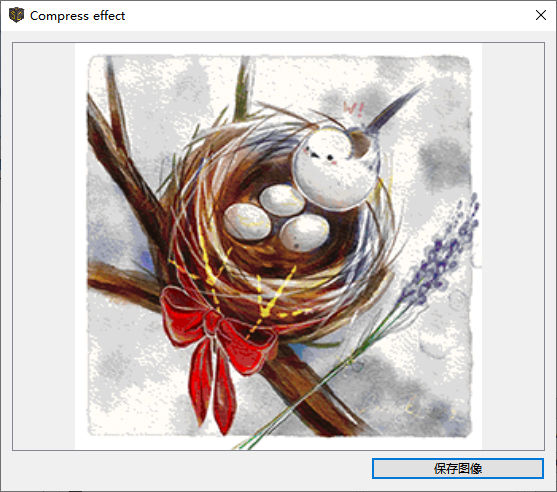 | 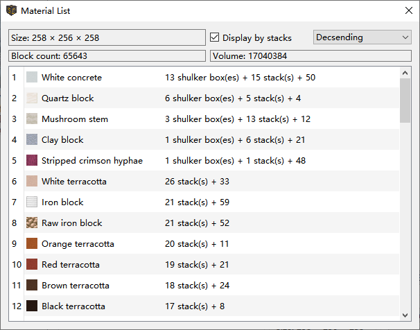 |
| :-----------------------------------------------------------------------------------------------: | :---------------------------------------------------------------------------------------------: |
|                                            Map preview                                            |                                          Material list                                          |

#### Export All

After confirming that the settings are correct, you can click **Export all** and select the appropriate **folder** to export all files (it is recommended to use an empty folder for batch operations).

______________________________________________________________________________________________________________

### 3.b Export as map data files

Click on the **Map data file** option to navigate to the corresponding page.

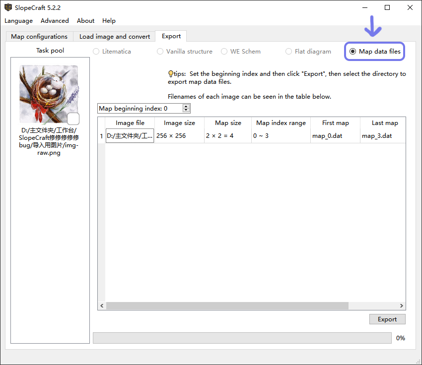

This page shows the number of rows and columns of the map corresponding to the map, the number of files and the file name of the map data file to be exported.

#### Set initinal map serial number

The file name of a map data file is `map_i.dat`, where i is an integer greater than or equal to 0, such as `map_3.dat`. **`i` is the serial number of this map data file. The serial number is actually the unique identifier of the map data file**. Under normal circumstances, our generated map data file should not overwrite unrelated map data files, so we need to pay more attention to setting the initial serial number.

Pressing <kbd>F3</kbd> + <kbd>H</kbd> (enable advanced tooltips) in-game will allow you to view item details, **including the Id of the map item, which is the serial number of the corresponding map data file**. The map item shown below corresponds to a map data file named `map_6.dat`.


There are two ways to obtain the map, choose the one you prefer. Note that the method you choose will affect the way you import into the game, so pay attention!

- If you want to obtain the map through the /give command:

    The starting number can be set arbitrarily, as long as it does not overwrite an unrelated map.

- If you do not want to use commands, only replace the map files:

    **1.** First create `n` maps corresponding to the map drawing, n is the number of map data files displayed by SlopeCraft, in this case 4.

    **2.** In the game, check the index corresponding to each map file. These maps should be indexed from `a` to `(a+n-1)`, a total of n maps.

    **3.** Exit the world, and enter the value `a` in the **Map file start number** field of SlopeCraft.

After confirming the settings, you can click **Export all**, and select the appropriate **folder** to export all files (it is recommended to use an empty folder).

______________________________________________________________________________________________________________

## Step 4. Importing Maps into the Game

=== "Litematica schematic"

    Open the folder where you just exported the files and move the exported files to the **schematic directory** (1).Then open Minecraft, go to the archive/server, and import this projection in the place where you want to create the map drawing.
    { .annotate }

    1. The directory for projection files is:  
	`.minecraft(1)/schematics`
		{ .annotate }
		
		1. Game saves and configurations are not necessarily stored directly in the `.minecraft` folder, and the specific path depends on the version isolation. Taking the `saves` folder location as an example: if version isolation is disabled, the saves directory is in `.minecraft/saves`, otherwise, it is in `.minecraft/versions/<your_game_version>/saves`.
		
	When placing the projection, please note: **the x and z coordinates of the projection origin must be `-65+k×128`, where k is any integer**. y coordinates are arbitrary. For example, (63,62,-65). Only then can the **ground drawing be aligned with the map's grid**.

	Then start realizing this projection or just paste the schematic. Once this is done, create a new map inside the map. Each map should be unscaled, as each pixel point corresponds to a block. Place them in order inside the item display box and you're done.

    - If it is a 2×2 map map, then you should create 2×2, i.e. 4 maps.
	- If your game version is 1.14 and above, then it is better to lock the map with a glass sheet inside the cartography table.

=== "Vanilla structure file"

    Open the folder where you just exported the files and move the exported files to the **Vanilla structure directory** (1).Then open Minecraft, enter your save/server, and load this structure at the desired location.
    { .annotate }

    1. The directory for Vanilla structure file is:  
	`.minecraft(1)/saves/<your_world_name>/generated/minecraft/structures`
		{ .annotate }
		
		1. Game saves and configurations are not necessarily stored directly in the `.minecraft` folder, and the specific path depends on the version isolation. Taking the `saves` folder location as an example: if version isolation is disabled, the saves directory is in `.minecraft/saves`, otherwise, it is in `.minecraft/versions/<your_game_version>/saves`.
		
    If you cannot find this directory, it means that the game has not created it yet. You can manually create this directory and copy the files into it.

    When loading the structure, please note: **the x and z coordinates of the projection origin must be `-65+k×128`, where k is any integer**. y coordinates are arbitrary. For example, (63,62,-65). Only then can the **ground drawing be aligned with the map's grid**.

    The use of structure blocks is relatively complicated, and it will not be repeated here. Please check out the tutorials yourself.

=== "WE schematic Files"

    Open the folder where you just exported the files and move the exported files to the **WE schematic directory** (1).
    { .annotate }

    1. The directory for World Edit schematics is:  
	`.minecraft(1)/config/worldedit/schematics`
		{ .annotate }
		
		1. Game saves and configurations are not necessarily stored directly in the `.minecraft` folder, and the specific path depends on the version isolation. Taking the `saves` folder location as an example: if version isolation is disabled, the saves directory is in `.minecraft/saves`, otherwise, it is in `.minecraft/versions/<your_game_version>/saves`.

    If the directory does not exist, it means that the game has not created it yet. You can manually create this directory and copy the files into it.

    After that, you can import the schematic into the game using the command `//schem load <schematic_name>`. For specific operations, please refer to the World edit tutorial, Please check out the tutorials yourself.

=== "Map data files"

    Open the folder where you just exported the files and move the exported files to the **map data file directory** (1).
    { .annotate }

    1. The directory for map files is:  
	`.minecraft(1)/saves/<your_world_name>/data`
		{ .annotate }
		
		1. Game saves and configurations are not necessarily stored directly in the `.minecraft` folder, and the specific path depends on the version isolation. Taking the `saves` folder location as an example: if version isolation is disabled, the saves directory is in `.minecraft/saves`, otherwise, it is in `.minecraft/versions/<your_game_version>/saves`.

    You may encounter a "Replace or Skip Files" window. If you are worried that unrelated map files will be overwritten, you can temporarily not select them and continue reading.

    - To obtain the map through the /give command:

        This method **should not** prompt a "Replace or Skip Files" window. If it does, close the window and check if there is a conflict with the map index.

		- In 1.12, use `/give @s filled_map 1 i` to obtain the map with index i.
		- In 1.13-1.20.4, use `/give @s filled_map{map:i}` to obtain the map with index i.
		- In 1.20.5+, use `/give @s filled_map[map_id=i]` to obtain the map with index i.

    - If you do not want to use commands, only replace the map files:

        **1.** When you move the files, a "Replace or Skip Files" window **should** appear. Click "Replace the files in the destination" to replace the files.

        **2.** Open the game, and these `n` maps should have been successfully replaced with map drawings.

## 🛠 Advanced functions


You can see some advanced operations in the "Advanced" menu. Each of them is described below.

### GACvter parameters

This menu item allows the user to set the parameters of the GACvter, as described above.

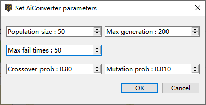

If you understand GA, then these parameters don't need to be explained. If you don't understand it, just google it, or just leave it alone.

The only parameter that needs to be explained is the **maximum early convergence generations**, which refers to the maximum number of consecutive generations of failed merit search allowed. For example, if its value is 50 generations, then the algorithm terminates when it does not find a better solution for 50 consecutive generations, saving time. A larger **maximum early convergence generation** will prevent the algorithm from maturing prematurely, but will make it slower.

### Cache

SlopeCraft uses caching to reduce memory usage when converting multiple images. Normally, the cache on disk will be automatically cleared when SlopeCraft exits, and users don't need to worry about the cache. However, SlopeCraft also allows users to manually clear the cache files.

### Test block list

Missing blocks in the projection are basically caused by **id misspellings**. If you import many blocks at once, this feature allows you to quickly test each block in the block list for id errors.

Testing the block list generates a special structured block file that contains every available block for each base color (except for those that do not match the version). Each block in the structure file is arranged in the order in which it appears in the block list.

If everything is fine, none of the blocks will be missing; if not, there is an id error in the corresponding block.

The following figure shows the effect. Due to the long projection, it is divided into two screenshots.

|  |  |
| :------------------------------------------------------------------------: | :-------------------------------------------------------------------------: |
|                                 Left half                                  |                                 Right half                                  |

### Export current colorset

This menu item allows the user to export the current color table as a $16\times 16$ png image, containing all the colors currently available.

|  |  |  |
| :--------------------------------------------------------------------------: | :----------------------------------------------------------------------------: | :--------------------------------------------------------------------------------: |
|                                   1.19 3D                                    |                                   1.19 Flat                                    |                                   1.19 File-only                                   |

??? question "What is it for?"
    Outputting the color map is essentially exporting the "palette" for pixel art creation.

    If you want to create your own art and use it in the game, follow these steps to avoid unexpected errors:

    1. First, complete the settings on the "Map Drawing Configuration" page so that you can output the color map you want.
    2. Export the color map in the advanced settings.
    3. Import the color map into the corresponding image processing software, create your artwork, and export the image.
    4. Complete the settings on the "Map Drawing Configuration" page again (if you have closed the software), and import the image.
    5. When converting the image, select the RGB+ algorithm and **do not** check dithering.
    6. The remaining export steps are the same as the normal process, see [above](#step-3-export).

______________________________________________________________________________________________________________

## 🛠 Customize blocklist

If you are not satisfied with my preset blocks and want to add other original blocks or even mod blocks yourself, this chapter will show you how to add and use custom blocks in SlopeCraft.

### Preliminary Information

You need to have the following information about the block.

1. The **complete** id of the block, containing the **namespace prefix** and **all block attributes**.

      If the upper half of the wax-coated copper block is tiled.

      ``` file
      minecraft:waxed_copper_slab[type=top,waterlogged=false]
      ```

      In this ``minecraft:`` is the namespace prefix for the original block, and the contents of the brackets are all block attributes. To be on the safe side, you should set the corresponding value for each block attribute.

2. The earliest version of the game in which the block appeared

      SlopeCraft has agreed on the following values in the block list to refer to major versions:

      | Numbers |     Versions      |
      | :-----: | :---------------: |
      |    0    | Earlier than 1.12 |
      |   12    |       1.12        |
      |   13    |       1.13        |
      |   14    |       1.14        |
      |   15    |       1.15        |
      |   16    |       1.16        |
      |   17    |       1.17        |
      |   18    |       1.18        |
      |   19    |       1.19        |
      |   20    |       1.20        |
      |   255   |  Future Versions  |

      Normally you shouldn't use 255, it's just a reserved value. If you have to assign a block to a future version, then everything that results is an undefined feature -- I don't know what will happen.

3. The id of the block in 1.12

      This property was added because Mojang changed the ids of quite a few blocks from 1.12 to 1.13. If the block you want to add was not added in 1.12, or if the id has not changed, you can fill in the empty string.

4. Base color of the block

      This is probably the easiest place to go wrong. For the original block, you can check the [Minecraft Wiki](https://minecraft.wiki/w/Map_item_format). If it's a mod custom block, either figure out how to measure it yourself or ask the mod developer.

      If you don't know what the base color is, go to [principles introduction](./principles-introduction.md)

5. Chinese name of the block
6. English name of the block
7. Whether the block needs to attach other blocks below itself
8. Whether the block glows
9. Whether the block is combustible
10. Whether the block can be stolen by the last shadow man
11. The texture image of the block (a 16*16 pixel png image is recommended)

### Blocks and block list

In SlopeCraft, the block list is stored in json format, and the related images are placed in the FixedBlocks and CustomBlocks folders.

There are two types of block lists: fixed block lists and custom block lists. The FixedBlocks list is the most basic list of blocks I provide, stored in **FixedBlocks.json** (the corresponding images are in the **FixedBlocks** folder), ensuring that there is a corresponding block for each base color. Although the blocks in the block list are in fact determined at program runtime, **you should not modify it**.

The custom blocks list is stored in **CustomBlocks.json**, and the corresponding images are in the **CustomBlocks** folder, which is a user-defined blocks list that allows the user flexibility to edit it. I have written some half-brick blocks in there, which can be used as a reference.

Each block has the following properties.

|  Property Name   |  Type  |            Required            |                              Default                               | Description                                                             |
| :--------------: | :----: | :----------------------------: | :----------------------------------------------------------------: | :---------------------------------------------------------------------- |
|    baseColor     |  byte  |              yes               |                                                                    | The map base color of the block                                         |
|        id        | string |              Yes               | The id of the block, including namespace and detailed block status |
|     version      |  byte  | is the earliest version of the |                               block.                               | nameZH                                                                  |
|      nameZH      | string |              Yes               |                            Chinese name                            |
|      nameEN      | string |              Yes               |                            English name                            |
|       icon       | string |              Yes               |       The file name of the corresponding image of the block.       |
|      idOld       | string |               No               |                            empty string                            | The id of the box in 1.12                                               |
|    needGlass     |  bool  |               no               |                               false                                | Indicates whether there must be other blocks at the bottom of the block |
|    isGlowing     |  bool  |               no               |                               false                                | Indicates whether the block is glowing                                  |
| endermanPickable |  bool  |               no               |                               false                                | Indicates whether or not the block can be stolen by an enderman         |
|     burnable     |  bool  |               no               |                               false                                | Indicates if the block can be burned                                    |

**The property `wallUseable` has been removed because the wall ground drawing has been removed.**

In json format, it is expressed as:

```json
{
   "baseColor":11,
   "id":"minecraft:cobblestone_slab[type=top,waterlogged=false]",
   "nameZH":"圆石台阶",
   "nameEN":"Cobblestone slab",
   "icon":"cobblestone_slab.png",
   "version":0,
   "idOld":"minecraft:stone_slab[half=top,variant=cobblestone]"
}
```

The above json message shows the information of a block with half a tile on a round stone, parsed as follows.

1. Its base color is 11, which is also the base color of round stone, stone tile, and stone.
2. Its block id is "minecraft:cobblestone\_slab[type=top,waterlogged=false]", the status of the block in brackets indicates that it is a top half brick and does not contain water.
3. Its Chinese name is "圆石台阶" and its English name is "Cobblestone slab".
4. Its image is a picture named "cobblestone_slab.png", which is placed under the CustomBlocks folder.
5. Its earliest appearance is version 0, which means it was added before 1.12.
6. Since its block id changed in 1.13, its block id in 1.12 is the value of idOld.

<!-- https://cdn.jsdelivr.net/npm/sakana-widget@2.7.0/lib/sakana.min.css -->
<!-- https://cdn.jsdelivr.net/npm/sakana-widget@2.7.0/lib/sakana.min.js -->
<!-- https://cdnjs.cloudflare.com/ajax/libs/sakana-widget/2.7.0/sakana.min.css -->
<!-- https://cdnjs.cloudflare.com/ajax/libs/sakana-widget/2.7.0/sakana.min.js -->

<link
  rel="stylesheet"
  href="https://cdn.jsdelivr.net/npm/sakana-widget@2.7.0/lib/sakana.min.css"
/>
<div id="sakana-widget"></div>
<script>
  function initSakanaWidget() {
    new SakanaWidget().mount('#sakana-widget');
  }
</script>
<script
  async
  onload="initSakanaWidget()"
  src="https://cdn.jsdelivr.net/npm/sakana-widget@2.7.0/lib/sakana.min.js"
></script>

*(=・ω・=)*
